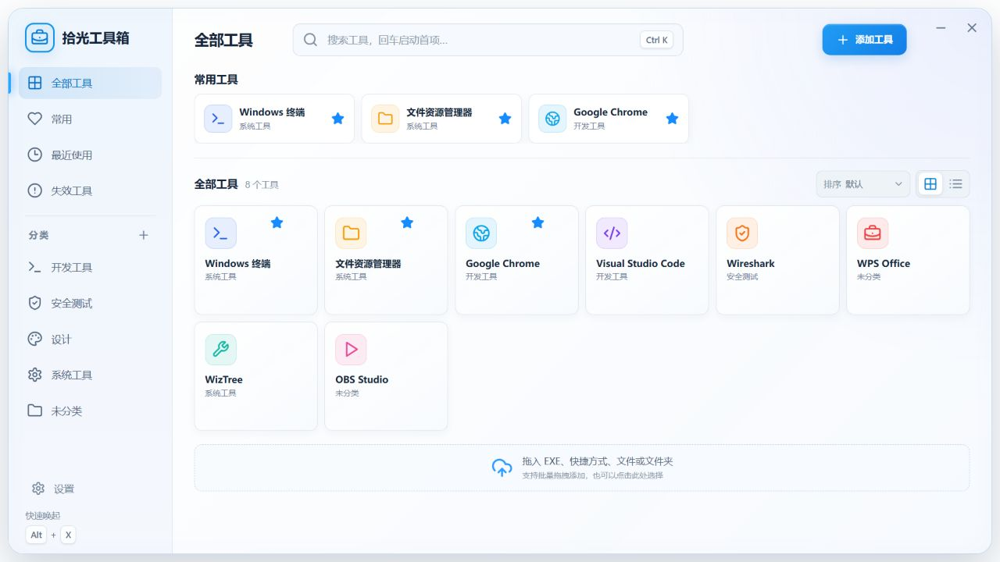
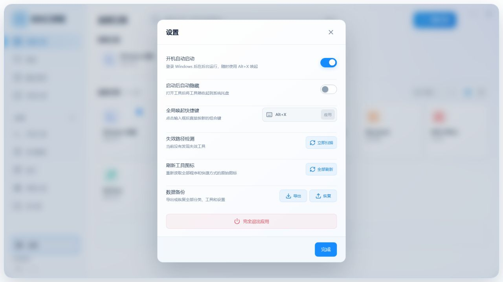

<div align="center">
  
  <h1>拾光工具箱</h1>
  <p>轻量、顺手的 Windows 桌面快捷启动器。</p>
  <p>
    
    
    
  </p>
</div>

按下可自定义的全局快捷键，随时呼出自己的工具空间。把 EXE、快捷方式、文件或文件夹拖进窗口，即可完成分类、搜索和快速启动。



## 下载与安装

无需配置开发环境，普通用户可以直接下载已经打包好的 Windows EXE：

- **安装版（推荐）**：[下载 ShiguangToolbox-Installer-1.1.0-x64.exe](https://github.com/zhangnanydl/ShiguangToolbox/releases/download/v1.1.0/ShiguangToolbox-Installer-1.1.0-x64.exe)  
  适合长期使用。下载后双击安装，之后可以从开始菜单启动。
- **便携版**：[下载 ShiguangToolbox-Portable-1.1.0-x64.exe](https://github.com/zhangnanydl/ShiguangToolbox/releases/download/v1.1.0/ShiguangToolbox-Portable-1.1.0-x64.exe)  
  无需安装，下载后直接双击运行，适合放在移动硬盘或工具目录中。

也可以进入 [GitHub Releases 发布页](https://github.com/zhangnanydl/ShiguangToolbox/releases/latest)，展开页面底部的 **Assets**，按需要选择带有 `Installer`（安装版）或 `Portable`（便携版）的 EXE 文件。请不要下载 `Source code`，它是供开发者使用的源代码压缩包，不能直接运行。

> 当前安装包尚未进行代码签名。Windows SmartScreen 可能显示“未知发布者”，请确认文件来自本项目的 GitHub Releases 页面后再运行。目前仅支持 Windows 10/11 x64。

## 功能亮点

- 自定义全局唤起快捷键，默认 `Alt + X`
- 记忆窗口位置和大小，再次唤起时原位显示
- 拖放或文件选择器批量添加 EXE、`.lnk`、文件与文件夹
- 分类、收藏、最近使用、搜索、排序、网格/列表视图
- 支持分类重命名、删除、图标配置与拖动排序
- 自动读取 Windows 原生图标并解析快捷方式目标
- 图标异常时可重新读取，或从 9 个内置预设图标中替换
- 为任意工具配置独立的全局快捷键
- 开机启动、启动工具后自动隐藏、系统托盘快捷菜单
- 失效路径扫描、重新定位、JSON 数据备份与恢复
- 数据只保存在本机，不需要登录或联网

## 设置



设置页可以修改全局快捷键、控制开机启动与启动后隐藏，并批量刷新工具图标。快捷键与其他工具或系统占用冲突时，应用会阻止保存或恢复到上一个可用组合键。

## 快速开始

1. 从上方下载链接获取安装版或便携版 EXE。
2. 启动后拖入需要管理的程序、快捷方式、文件或文件夹。
3. 双击卡片启动工具；右上角菜单可编辑、定位或移除。
4. 在「设置」中修改全局唤起快捷键和启动行为。

> 目前仅支持 Windows 10/11 x64。

## 本地开发

需要 Node.js 20 或更高版本。

```powershell
npm install
npm run dev
```

仅预览浏览器界面时，可以访问 Vite 输出地址并添加 `?preview=1`，页面会使用不包含个人数据的演示内容。

## 构建发布包

```powershell
npm run dist
```

安装版、便携版和增量更新描述文件会生成在 `release/` 目录。

## 项目结构

```text
ShiguangToolbox/
├─ build/            # 应用图标与打包资源
├─ docs/             # README 截图与设计参考
├─ electron/         # Electron 主进程和安全桥接
├─ src/              # React 界面、状态与样式
├─ package.json
└─ vite.config.js
```

用户配置保存在 Electron 的 `userData/toolbox-data.json`。卸载或升级前可以在设置中导出 JSON 备份。

## 参与贡献

欢迎提交 Bug、交互建议和 Pull Request。开始前请阅读 [CONTRIBUTING.md](CONTRIBUTING.md)。提交代码时请勿包含个人工具路径、用户数据、`release/` 或 `node_modules/`。

## 许可证

本项目使用 [MIT License](LICENSE)。
